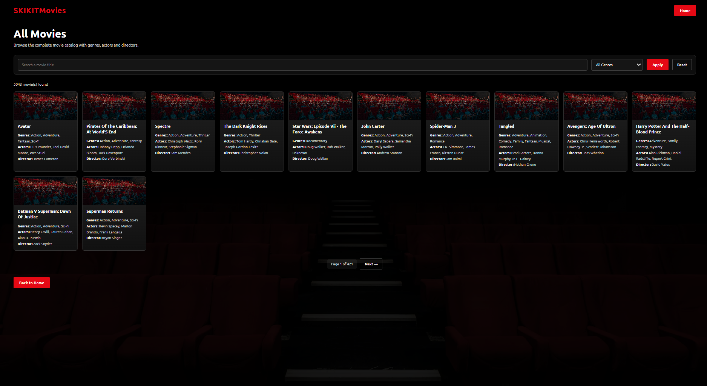
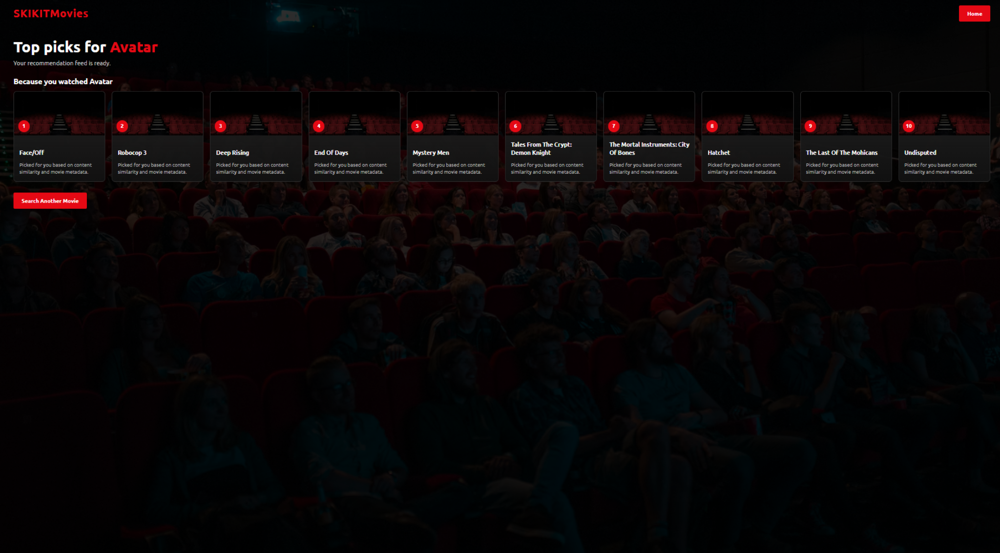

# Movie Recommendation System

A content-based movie recommendation web application built with **Python** and **Flask**.  
The system recommends similar movies using metadata such as **genres, actors, and director**, with **TF-IDF** vectorization and **cosine similarity**.

## Application Preview

### Home Page


### Movies Catalog


### Recommendation Page



## Features

- Search for a movie and get similar recommendations
- Browse the full movie catalog
- Filter movies by genre
- Search movies by title
- Paginated movie catalog
- Netflix-inspired user interface

## Project Overview

This project is based on a **content-based recommendation approach**.  
Instead of using user ratings, it recommends movies by comparing their metadata.

The recommendation pipeline includes:
- data preprocessing with **Pandas**
- feature engineering from movie metadata
- weighted metadata combination
- text vectorization with **TF-IDF**
- similarity computation with **cosine similarity**

## Tech Stack

- **Python**
- **Flask**
- **Pandas**
- **scikit-learn**
- **HTML / CSS**
- **Jupyter Notebook**
- **matplotlib**

## Recommendation Method

The recommendation engine uses:
- **Genres**
- **Director**
- **Actor 1**
- **Actor 2**
- **Actor 3**

To improve recommendation quality, weighted features were used:
- genres repeated more times
- director weighted more than actors

Then:
1. the combined text features are vectorized with **TF-IDF**
2. pairwise similarities are computed using **cosine similarity**
3. the system returns the most similar movies

## Project Structure

```bash
Movie_Recommendation_System/
│
├── main.py
├── create.py
├── data.csv
├── movie_metadata.csv
├── preprocessing.ipynb
├── comparaison.ipynb
├── requirements.txt
├── Procfile
├── similarity_matrix.npy
└── templates/
    ├── home.html
    ├── recommend.html
    └── movies.html

